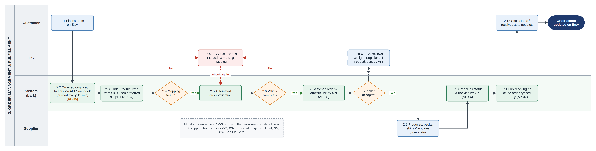
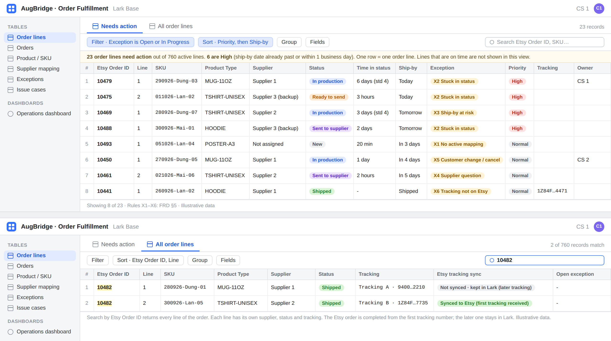

# AugBridge Commerce – Order Fulfillment Automation & Exception Monitoring

**Business Analysis case study** · BRD · FRD · User Stories · UAT Test Cases · RTM · SQL

AugBridge Commerce is a small cross-border e-commerce business selling personalized products through 6 Etsy shops, with 3 external suppliers and a 9-person team. Weekly volume is about 400 orders, rising to about 2,800 in peak season (~7×).

> **Note:** This is a portfolio case study based on hands-on experience in cross-border e-commerce. The company and the dataset are simulated, and the solution has not been built. No results or targets are claimed.

## Key numbers

| Pain points | Business requirements | Functional requirements | User stories | UAT test cases | Simulated orders |
|:---:|:---:|:---:|:---:|:---:|:---:|
| **10** | **7** | **16** | **16** | **34** | **10,685** |
| 2 out of scope | | | | not run | 12 weeks |

## Main problem

Each order needs 4 manual steps: selecting a supplier, entering the order in the supplier's system, checking status repeatedly, and copying tracking back to Etsy. The manual work grows with order volume, so late orders are harder to spot in peak season.


*As-Is order fulfillment process ([BRD §4](docs/02-brd.md#4-current-process-as-is))*

## Proposed solution

The proposed solution uses Lark as one shared workspace. Orders come in from Etsy automatically and are sent to the supplier by API. The preferred supplier comes from the Product Type of each order line; Suppliers 1 and 2 are primary, and Supplier 3 is a backup for single order lines. CS works from an exception queue instead of checking every order.



*To-Be order fulfillment process. Green boxes are done by the system ([FRD §4](docs/03-frd.md#4-to-be-process))*

## BA approach

As-Is Process → Evidence from a simulated dataset (SQL) → Root Cause Analysis → Business Requirements → Solution Selection → To-Be Design in Lark → Functional Requirements → User Stories → UAT → Traceability (RTM)

## Documents

All documents can be read directly on GitHub. Suggested order:

| # | Document | Purpose |
|---|---|---|
| 01 | [Project Summary](docs/01-project-summary.md) | The full story in 11 slides |
| 02 | [BRD](docs/02-brd.md) | Why the change is needed: problem, evidence, root cause analysis, business requirements, business case |
| 03 | [FRD](docs/03-frd.md) | How the solution works: To-Be process, exception logic, integration, data model, functional requirements |
| 04 | [User Stories](docs/04-user-stories.md) | Requirements from the user's point of view, with acceptance criteria |
| 05 | [UAT Test Cases](docs/05-uat-test-cases.md) | How business behavior will be checked: steps, test data and expected results (not run). Technical checks are marked. |
| 06 | [RTM](docs/06-rtm.md) | Traceability from pain point to test case, with the reason for each link |
| – | [Data](data) & [SQL](sql) | Simulated data and the SQL behind BRD §5.1: schema, queries, full dataset and sample rows |
| – | [Assets](assets) | Full-size As-Is and To-Be diagrams, data model, wireframes and slide images |

Short on time? Read the [Project Summary](docs/01-project-summary.md) first, then the [RTM](docs/06-rtm.md).

## Main decisions

| Decision | Reason |
|---|---|
| 1. CS works only on order lines that need action through an exception queue. | Checking every order manually does not scale during peak season. |
| 2. Use Lark as one shared workspace. Orders go to suppliers by API; Supplier 3 is a backup. | Information is spread across too many tools. All three suppliers support API; CS uses the backup for single order lines only. |
| 3. Keep the 4 PD&CS roles as they are. Separating PD and CS is out of scope. | Separating the roles could reduce context switching, but would not remove the repetitive order work targeted by this project. It can be considered later by management. |



*Wireframe of the exception queue in Lark Base, with illustrative data ([FRD §10](docs/03-frd.md#10-wireframes))*

## Traceability example

Every in-scope pain point links to a business requirement, functional requirements, user stories and test cases. One example from the [RTM](docs/06-rtm.md):

| Pain point | Business requirement | Functional requirements | User stories | Test cases |
|---|---|---|---|---|
| AP-04: supplier selection is done manually for each order | BR-02: Product Type-to-preferred-supplier mapping | FR-03, FR-04 | US-03, US-04 | TC-03a, TC-04a, TC-04b, TC-04c |

## Data and SQL

There is no central order database in the current process, so a simulated 12-week dataset (6 shops, 3 suppliers, 15 SKUs, 10,685 orders) was created and analyzed in SQLite.

| Weeks | Orders per week | Overdue rate |
|---|---|---|
| Normal weeks (1–7, 12) | 380 to 520 | 5.2% to 7.1% |
| Peak weeks (8–11) | 900 to 2,750 | 81.0% to 83.7% |

*Overdue = order-to-delivery time above 10 business days.*

The overdue rate is context only, not a KPI or target. The data does not separate internal handling, supplier production, and carrier time, so it does not prove what causes the delays ([BRD §5.1](docs/02-brd.md#51-sql-analysis-of-simulated-order-data)).

To run the queries:

```bash
sqlite3 data/augbridge_simulated.db < sql/analysis_queries.sql
```

More detail is in [`data/README.md`](data/README.md).

## What this case study covers

| BA work | Where |
|---|---|
| Pain points and gaps | [BRD §3](docs/02-brd.md#3-problem-statement-and-pain-points) |
| As-Is and To-Be process diagrams | [BRD §4](docs/02-brd.md#4-current-process-as-is), [FRD §4](docs/03-frd.md#4-to-be-process) |
| SQL analysis of simulated data | [BRD §5](docs/02-brd.md#5-evidence-and-data-analysis), [`sql/`](sql) |
| Root cause analysis | [BRD §6](docs/02-brd.md#6-root-cause-analysis) |
| Scope, stakeholders, assumptions and constraints | [BRD §7–9](docs/02-brd.md#7-business-objectives-and-project-scope) |
| Business requirements, business rules and KPIs | [BRD §10–12](docs/02-brd.md#10-business-requirements) |
| Business case and risks | [BRD §13–14](docs/02-brd.md#13-business-case) |
| Solution evaluation with weighted criteria | [FRD §2](docs/03-frd.md#2-solution-evaluation-and-selection) |
| Roles, RACI and access by role | [FRD §3](docs/03-frd.md#3-to-be-roles-and-access) |
| Exception rules and order line statuses | [FRD §5](docs/03-frd.md#5-exception-handling) |
| Integration overview and field mapping | [FRD §6](docs/03-frd.md#6-integration-overview) |
| Logical data model | [FRD §7](docs/03-frd.md#7-data-model) |
| Functional and non-functional requirements | [FRD §8–9](docs/03-frd.md#8-functional-requirements) |
| Wireframes | [FRD §10](docs/03-frd.md#10-wireframes) |
| Release plan and pilot | [FRD §11](docs/03-frd.md#11-release-plan) |
| User stories with acceptance criteria | [User Stories](docs/04-user-stories.md) |
| UAT test cases, including negative tests | [UAT Test Cases](docs/05-uat-test-cases.md) |
| Requirements traceability | [RTM](docs/06-rtm.md) |

## Repository structure

```
.
├── README.md                  Project overview (this page)
├── docs/                      Documents in Markdown, readable on GitHub
│   ├── 01-project-summary.md
│   ├── 02-brd.md
│   ├── 03-frd.md
│   ├── 04-user-stories.md
│   ├── 05-uat-test-cases.md
│   └── 06-rtm.md
├── assets/
│   ├── diagrams/              As-Is and To-Be process diagrams, system context, data model
│   ├── wireframes/            Needs action view, operations dashboard
│   └── slides/                Slide images for the Project Summary
├── data/                      Simulated dataset (SQLite + CSV) and data dictionary
├── sql/                       Schema and analysis queries with their output
└── original-files/            Word, Excel and PowerPoint versions
```

## Limitations

The solution is not built, the order data is simulated (BRD §5.1), and supplier API access will be confirmed in R0. Manual work per order is a working hypothesis, tested in a pilot by measuring manual order-handling time before and after the change (R0 vs. R2). No results or targets are claimed.
