# Project Summary

*AugBridge Commerce - The full story in 11 slides*

[README](../README.md) · [BRD →](02-brd.md)

---

The PowerPoint file is in [`original-files/`](../original-files) (`01_Project_Summary.pptx`).

## 1. Order Fulfillment Automation & Exception Monitoring

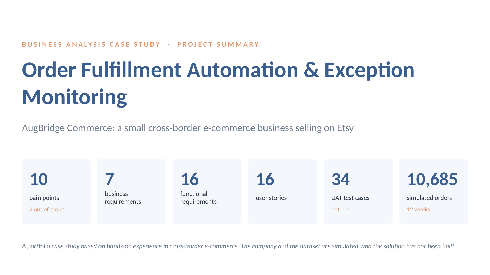

## 2. Business Context and Problem

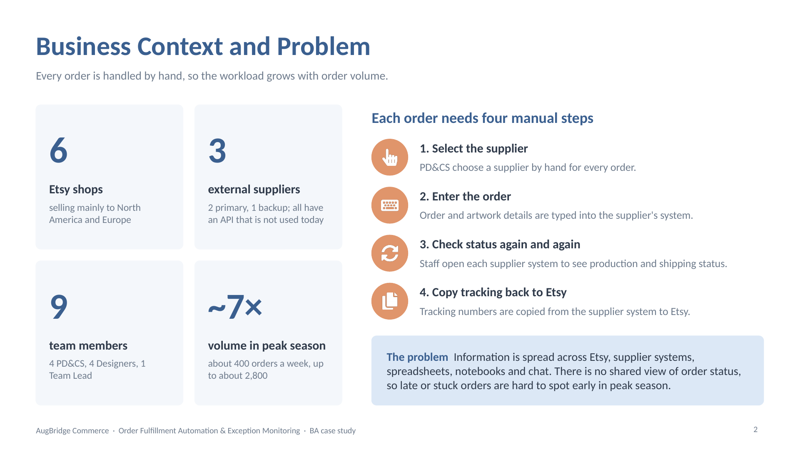

## 3. As-Is Process and Pain Points

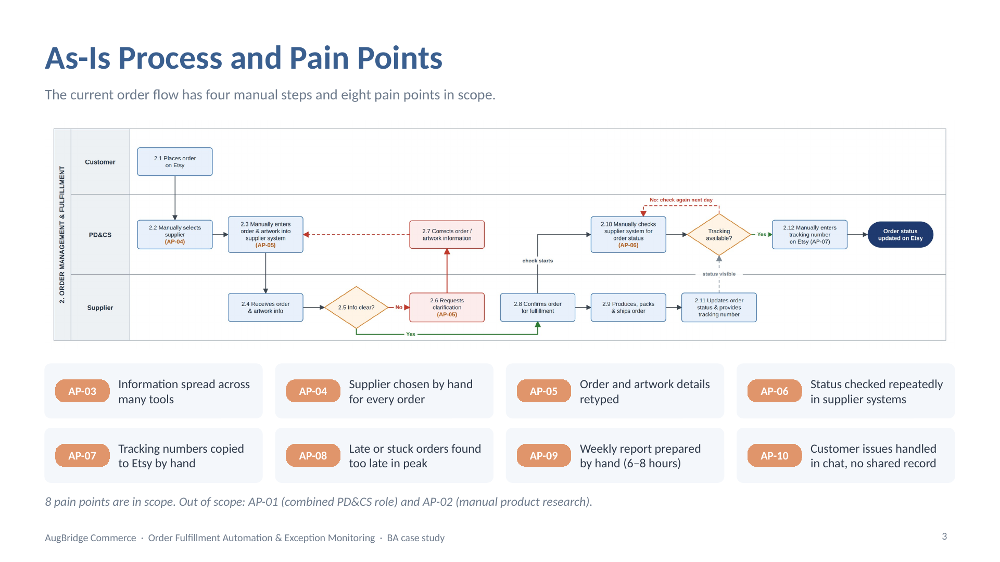

## 4. Evidence and Root Cause Analysis

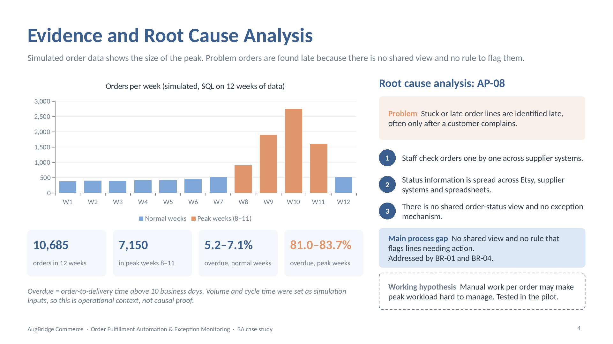

## 5. Business Objectives and Requirements

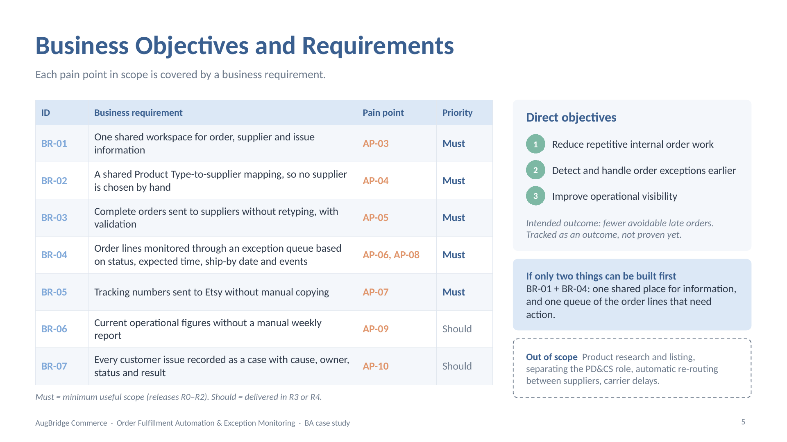

## 6. Solution Evaluation and Selection

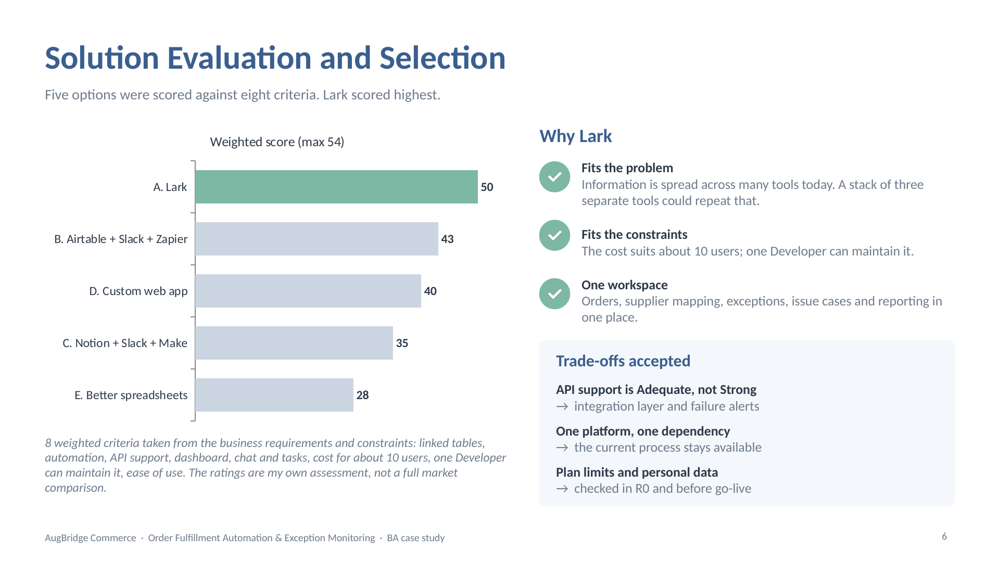

## 7. To-Be Process

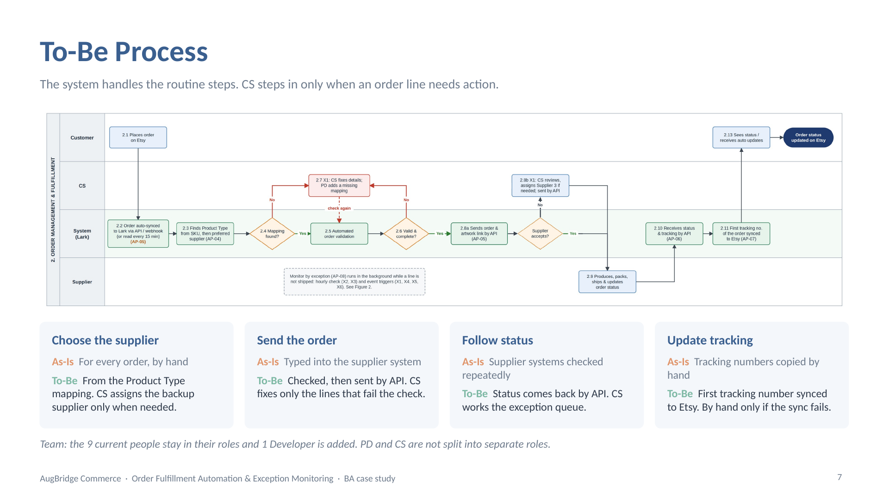

## 8. Exception Handling

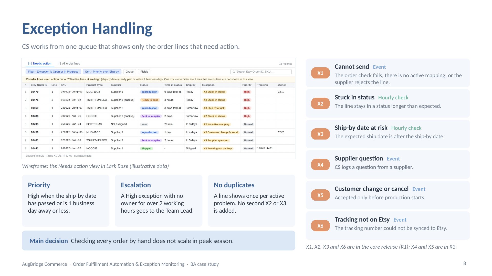

## 9. Requirements Traceability and UAT

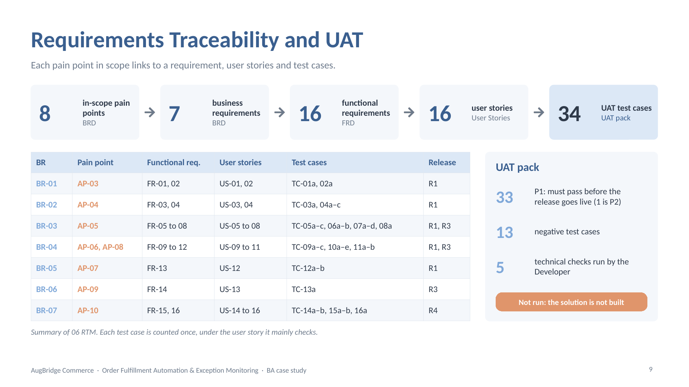

## 10. Release Plan and Pilot

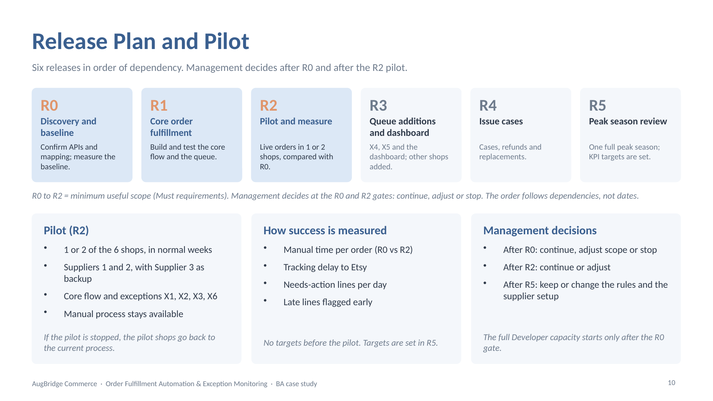

## 11. Business Case, Risks and Limitations

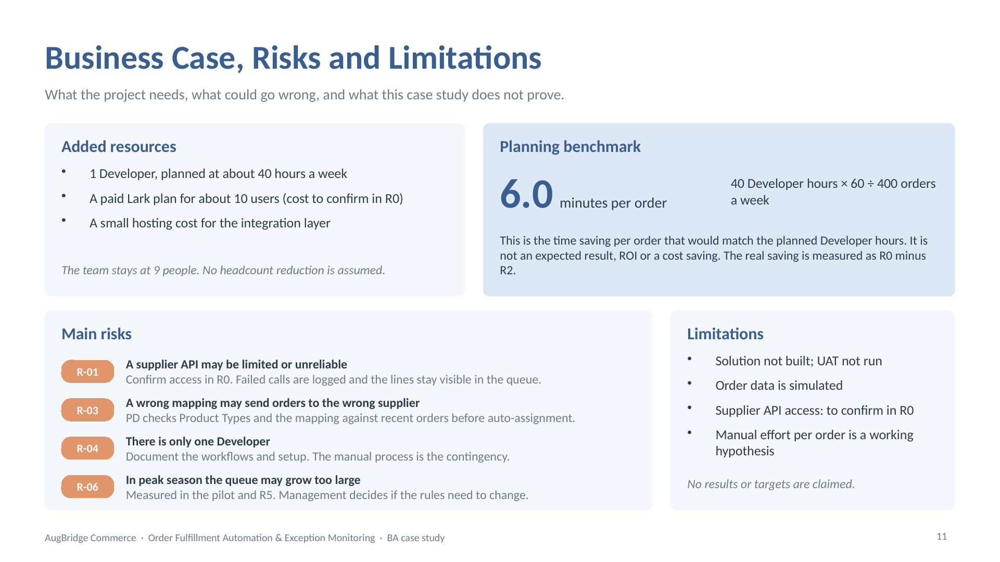

---

[README](../README.md) · [BRD →](02-brd.md)
