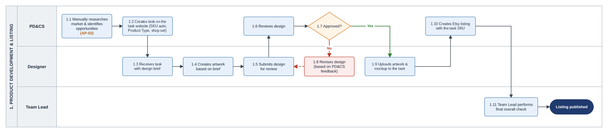
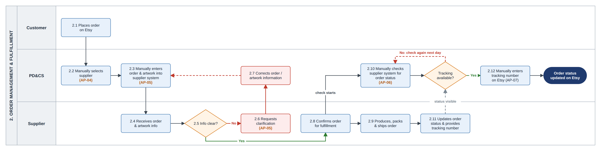
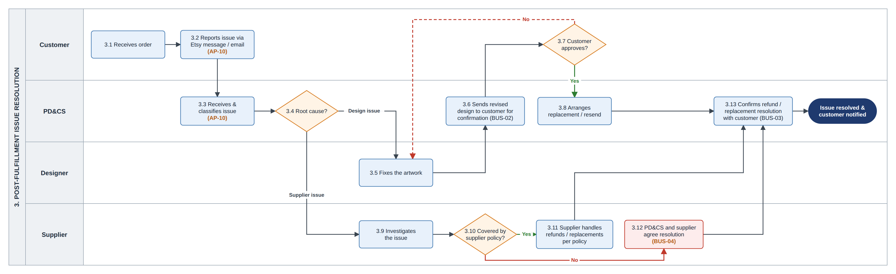
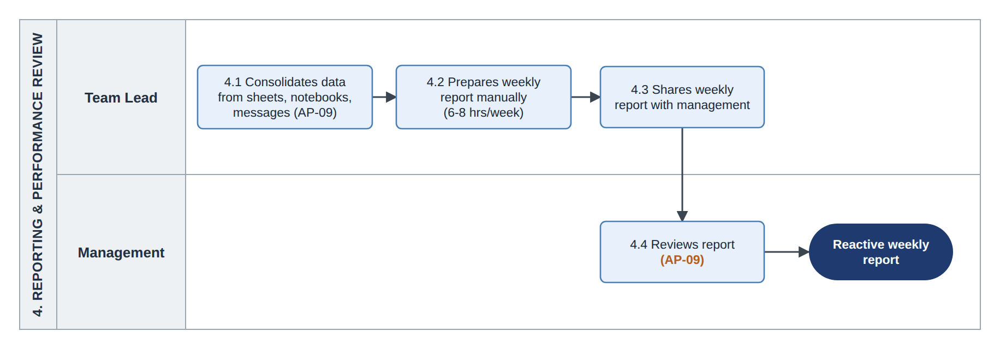

# Business Requirements Document (BRD)

*AugBridge Commerce - Order Fulfillment Automation & Exception Monitoring*

[← Project Summary](01-project-summary.md) · [README](../README.md) · [FRD →](03-frd.md)

---

## 1. Project Overview

AugBridge Commerce is a small cross-border e-commerce business with 9 team members and 6 Etsy shops. Four team members handle both Product Development (PD) and Customer Support (CS). Order fulfillment is mostly manual: choosing the supplier, entering order details in supplier systems, checking status, copying tracking to Etsy, and preparing reports.

This manual work grows with every order, and there is no shared view of which orders are stuck or at risk. In peak season, volume can reach about 7 times a normal week, and late or stuck orders are often found too late.

A simulated 12-week dataset shows much higher volume and worse delivery times in peak weeks. The data does not show how much of the delay comes from internal handling, so it is used as context only (see §5.1).

The main process gap is that there is no shared order-status view and no rule to flag lines that need action, so they are hard to spot early (see §6.1). Repetitive manual work per order may also make peak workload hard to manage; this is a working hypothesis to be tested in the pilot (see §13).

The proposed solution uses Lark as one shared workspace. Orders come in from Etsy automatically and are sent to the supplier by API. The preferred supplier comes from the Product Type of each order line; Suppliers 1 and 2 are primary, and Supplier 3 is a backup for single order lines. CS works from an exception queue instead of checking every order. The team keeps its current 9 people and adds 1 Developer. Separating the PD&CS role (AP-01) is out of scope (see §6.2).

The project defines 10 pain points (2 out of scope), 7 business requirements, 16 functional requirements, 16 user stories, and 34 test cases. The system has not been built, so no implementation or UAT results are claimed.

## 2. Business Background

AugBridge Commerce is a small cross-border e-commerce business with 6 Etsy shops, selling mainly to North America and Europe. It works with 3 external suppliers that produce and ship products after an order is placed. Suppliers 1 and 2 are the primary suppliers and Supplier 3 is the backup. All three have an API, which is not used today.

| Item | Value | Label |
|---|---|---|
| Current Team | 9 people (4 Product Development & Customer Support (PD&CS), 4 Designers, 1 Team Lead) | Scenario |
| Orders per week | About 400 in a normal week (planning baseline); up to about 2,800 in peak season | Scenario |
| Order-to-delivery time | About 9 business days on average; longer in peak season | Scenario |
| Weekly reporting effort | 6–8 hours per week for the Team Lead | Estimate |

**Evidence labels:** The process steps, roles and handoffs in this case study come from my operational experience in this type of business. Figures carry one of these labels.

| Label | Meaning | Used for |
|---|---|---|
| **Scenario** | Set for this case study, based on the kind of team I worked in | Team size, order volume, suppliers, cycle time |
| **Estimate** | A rough figure, not measured | Weekly reporting effort, reporting time saved by the dashboard |
| **Simulated** | From the 12-week SQL dataset (see §5.1) | Peak volume, overdue rate |
| **Assumption** | Must be confirmed before or during the pilot | Etsy and supplier API access, supplier policy, Developer hours, system timings |
| **Working hypothesis** | A possible contributor that the pilot must test | Manual work per order (see §6.1) |

**Requirement Sources and Validation**

This case study is based on hands-on experience in cross-border e-commerce and was built independently as a portfolio project. The scenario, data, processes and solution were created for this project and do not represent any specific company. In a real project they would be validated through user interviews, time sampling, supplier discussions and To-Be walkthroughs before UAT.

## 3. Problem Statement and Pain Points

### 3.1 Problem Statement

Most order work is done by hand. Four PD&CS staff select the supplier, enter the order, check status and update tracking for every order, so the workload grows with order volume. Operational information is spread across Etsy, supplier systems, spreadsheets, notebooks and messaging apps, so there is no shared view of order status. In peak season, at about 2,800 orders per week, late or stuck orders are hard to spot early.

### 3.2 Pain Points and Gaps

| ID | Pain point | What is missing (gap) |
|---|---|---|
| **AP-01** | PD&CS handles both product development and customer support, creating role overlap and context switching. | Clear separation between PD and CS responsibilities. *(Out of scope; see §6.2.)* |
| **AP-02** | Product research is manual and time-consuming. | A structured research method. *(Out of scope; see §7.2.)* |
| **AP-03** | Order, supplier, and issue information is spread across Etsy, supplier systems, spreadsheets, notebooks, and chat apps. | One shared place to view order, supplier, and issue status. |
| **AP-04** | Supplier selection is done manually for each order, including switching to the backup supplier when needed. | A shared rule for assigning the preferred supplier by Product Type. |
| **AP-05** | Order and artwork details are re-entered into supplier systems. Missing information is handled through chat. | Automatic order data transfer, validation before submission, and a record of supplier notifications. |
| **AP-06** | PD&CS repeatedly check supplier systems for production and shipping status. | A single place to see which order lines need attention. |
| **AP-07** | Tracking numbers are copied manually from supplier systems to Etsy. | Automatic tracking updates to Etsy without manual copying. |
| **AP-08** | Checking every order does not scale during peak season, so late or stuck order lines may be found too late. | Exception-based monitoring so staff can focus on order lines that need action. |
| **AP-09** | The Team Lead prepares the weekly report manually, which delays visibility into operational issues. | Up-to-date operational figures without a manual weekly report. |
| **AP-10** | Customer issues such as wrong prints, damage, or lost parcels are handled in chat without a shared record. | A shared case record with cause, owner, status, and resolution. |

## 4. Current Process (As-Is)

### 4.1 Product Development and Listing (Context, Out Of Scope)



*Figure 1. As-Is Product Development and Listing Process Diagram*

PD&CS manually research products (AP-02), create a task for each new product on the internal task platform, review the design, and create the Etsy listing. The same four people also handle orders, causing AP-01. The platform only stores product tasks; it does not handle orders, suppliers, or fulfillment. This process is out of scope but provides the product data used in fulfillment.

When PD creates a task (1.2), the platform automatically assigns a SKU. PD selects the Product Type and Etsy shop. Multiple SKUs can share a Product Type, but each SKU is listed on only one Etsy shop. The Designer uploads the artwork and mockup (1.9). PD then creates the Etsy listing and manually enters the same SKU (1.10), so the SKU is carried into each order line.

Currently, this data is not used for automatic supplier assignment. PD&CS manually selects the supplier for each order line (AP-04).

### 4.2 Order Management and Fulfillment



*Figure 2. As-Is Order Fulfillment Process Diagram*

### 4.3 Post-fulfillment Issue Resolution



*Figure 3. As-Is Post-Fulfillment Issue Resolution Process Diagram*

### 4.4 Reporting and Performance Review



*Figure 4. As-Is Weekly Reporting Process Diagram*

## 5. Evidence and Data Analysis

The project does not currently measure the time spent on each manual order step, the time from supplier shipment to the tracking number appearing on Etsy, or late shipments against the Etsy ship-by date. These measures will be established as the baseline in R0 (FRD §11).

### 5.1 SQL Analysis of Simulated Order Data

There is no central order database in the current process, so a simulated 12-week dataset was created and analyzed in SQLite. The dataset contains 6 shops, 3 suppliers, 15 SKUs, and 10,685 orders, with weeks 8–11 as peak season. The schema, SQL queries, full dataset, and sample rows are available in the Data & SQL folders ([`data/`](../data), [`sql/`](../sql)). The analysis compares weekly order volume and overdue rates. An order is considered overdue when its order-to-delivery time exceeds 10 business days.

**Query - Weekly order volume and overdue rate**

```sql
SELECT week_number,
       COUNT(*) AS total_orders,
       SUM(is_overdue) AS overdue_orders,
       ROUND(100.0 * SUM(is_overdue) / COUNT(*), 1) AS overdue_rate_pct
FROM orders
GROUP BY week_number
ORDER BY week_number;
```

**Result**

| week_number | total_orders | overdue_orders | overdue_rate_pct |
|---|---|---|---|
| **1** | 380 | 23 | 6.1 |
| **2** | 410 | 25 | 6.1 |
| **3** | 395 | 28 | 7.1 |
| **4** | 420 | 22 | 5.2 |
| **5** | 430 | 28 | 6.5 |
| **6** | 460 | 30 | 6.5 |
| **7** | 520 | 36 | 6.9 |
| **8** | 900 | 729 | 81.0 |
| **9** | 1,900 | 1,590 | 83.7 |
| **10** | 2,750 | 2,246 | 81.7 |
| **11** | 1,600 | 1,318 | 82.4 |
| **12** | 520 | 32 | 6.2 |

The dataset contains 10,685 orders, including 7,150 orders in peak season. The simulation sets average order-to-delivery time at 8.6 business days in normal weeks and 13.5 business days in peak season. The results therefore show the problem as modeled, but do not prove what causes the delays.

The data does not separate internal handling, supplier production, and carrier time. Supplier assignments were also randomized, so the dataset cannot be used to compare suppliers or estimate supplier workload.

The 82% overdue rate is context only, not a KPI or target. The project therefore uses manual handling time and exception workload as the main operational measures.

## 6. Root Cause Analysis

### 6.1 AP-08: Late Detection of Stuck or Late Order Lines

| Step | Description |
|---|---|
| **Problem** | During peak season, stuck or late order lines may be found too late, sometimes only after a customer raises an issue. |
| **Cause chain** | 1. PD&CS checks order status manually across different supplier systems.<br>2. Order status information is spread across Etsy, supplier systems, and spreadsheets.<br>3. There is no shared order-status view or exception mechanism to flag lines that need action. |
| **Main process gap** | There is no shared order-status view or rule to identify order lines that need attention early. BR-01 and BR-04 address this gap. |
| **Working hypothesis** | Repetitive manual work per order may make the workload harder to manage during peak season. The current data cannot confirm this, so the pilot will test it by measuring manual order-handling time per order in R0 and R2 (see §13). |

### 6.2 AP-01: Combined PD&CS Role

PD&CS handles both product development and customer support, which creates overlapping responsibilities and context switching.

Separating the two roles could improve focus, but it would not remove the repetitive order work targeted by this project. Therefore, role separation is out of scope.

Management may consider separate PD and CS roles later. Pilot workload data can help inform that decision.

## 7. Business Objectives and Project Scope

### 7.1 Business Objectives

| Objective | Description |
|---|---|
| Reduce repetitive order work | Reduce manual work in supplier selection, order entry, status checking, tracking updates, and weekly reporting. Staff should mainly work on order lines that need action instead of checking every order manually. |
| Detect and handle order exceptions earlier | Identify order lines that need attention, including lines that may miss the Etsy ship-by date, so the team can act earlier where possible. |
| Improve operational visibility | Provide one shared view of order status, supplier status, exceptions, and customer issues. |
| Reduce avoidable late or overdue orders | This is an expected outcome of the three objectives above. It is not yet proven and also depends on supplier production and carrier time (see §12). |

### 7.2 Project Scope

**In scope**

- Shared operational tracking for orders, suppliers, and customer issues
- Product Type-to-preferred-supplier mapping
- Controlled use of Supplier 3 as a backup for a single order line when the primary supplier cannot fulfill it
- Automated order intake and validation
- Sending orders to suppliers through API
- Supplier status and tracking updates through API
- Tracking synchronization to Etsy
- Exception-based monitoring through one queue, including supplier notifications that need action and customer change/cancel requests
- Post-fulfillment issue cases, including replacement artwork for issue-driven replacements
- Operational dashboard for the team and management.

**Out of scope**

- Product research, Product/Design Tasks, and listing preparation (AP-02)
- Separating the PD&CS role (AP-01).
- Listing content, SEO, photography, and marketing
- New artwork outside issue-driven replacements
- Payment and refund processing inside Etsy
- Hiring, HR execution, or individual staff performance measurement
- Changes to supplier systems
- Automatic supplier re-routing
- Supplier stock or capacity data
- Carrier delays after shipping
- Sales and volume analysis by SKU or supplier

## 8. Stakeholders

| Stakeholder | Role / Responsibility | Interest Level | Influence Level | Key Requirements | Engagement Strategy | Frequency of Interaction | Communication Method |
|---|---|---|---|---|---|---|---|
| **PD&CS**<br>**(4 people)** | Product research, product development, order management, and customer support | High | High | Reduce manual work and make the new process easy to use | Review the current and To-Be process; involve in UAT | Weekly | Meetings, team chat |
| **Designers<br>(4 people)** | Create artwork and replacement artwork for design cases | High | Low | Receive clear requests and complete information for design cases | Review the design-case flow; involve in UAT for design cases | Weekly | Meetings, team chat |
| **Team Lead (1 person)** | Runs daily operations, sets priorities, and reviews operational performance | High | High | Get early visibility of issues and keep workload manageable | Review process and dashboard; set priorities during the pilot | Weekly | Meetings, reports |
| **Management** | Approves the solution, staffing, and major changes | High | High | Understand the cost, expected value, and key risks | Review business case and pilot results; approve major decisions | Monthly / As needed | Presentations, Reports |
| **Suppliers (3)** | Produce and ship orders; provide status and tracking | Medium | High | Receive orders and provide status and tracking through their API | Confirm API access (R0); agree on fallback conditions and process changes | As needed | Email, Messaging |
| **Customers** | Place orders and receive support for delivery or issue cases | High | Low | Receive orders on time and get clear issue resolution | No direct project involvement; feedback is handled through CS | As needed | Etsy messages, Email |

**To-Be change:** one Developer role is added for Lark setup, integrations and workflow maintenance. Management approves major changes, and the Developer implements them. The staffing assumption is in §13.

## 9. Assumptions and Constraints

### 9.1 Assumptions

- Etsy order data is available through an API or webhook. If webhook access is not available, the system will use regular polling.

- All three suppliers have APIs for order submission, status, and tracking. Suppliers 1 and 2 are the primary suppliers, and Supplier 3 is the backup. API access and limits will be confirmed in R0.

- Each Product/Design Task has a SKU, Product Type, and one Etsy shop, and the SKU is carried into the Etsy order line. Lark will receive the required product data through synchronization or regular import, to be confirmed in R0.

- Customer personalization is sent as text with the order. Standard artwork is already available for each SKU.

- New artwork is created only for issue-driven replacements. Other new artwork per order is out of scope.

- Suppliers continue to use their own systems and do not use Lark.

- Customers continue to contact the shops through Etsy messages and email.

- The Developer role is planned at about 40 hours per week (see §13).

### 9.2 Constraints

- Tool and integration costs must fit the needs and budget of a 10-person business.

- Customer names and addresses are personal data, so a data-handling policy must be agreed before go-live (NFR-04).

## 10. Business Requirements

| ID | Business requirement | Source | Priority | Acceptance Criteria |
|---|---|---|---|---|
| **BR-01** | Provide one shared workspace for order, supplier, and issue information. | AP-03 | Must | Core order, supplier, and exception information is available in one workspace from R1. Issue-case information is added in R4 under BR-07. |
| **BR-02** | Maintain a Product Type-to-preferred-supplier mapping for automatic supplier assignment. | AP-04 | Must | Each order line is assigned the preferred supplier for its Product Type. Unroutable lines are flagged for CS, and Supplier 3 is used only under BUS-06. |
| **BR-03** | Send complete order and artwork data to suppliers without retyping, with validation and supplier notification tracking. | AP-05 | Must | Complete orders are sent by API without retyping. Incomplete orders are stopped before submission. Supplier notifications are recorded from R3. |
| **BR-04** | Monitor order lines through an exception queue based on status, expected time, ship-by date, and relevant events. | AP-06, AP-08 | Must | Only order lines that meet an exception rule appear in the queue, with an exception reason and priority. An owner is set when CS takes the exception. |
| **BR-05** | Send tracking numbers to Etsy automatically where supported. | AP-07 | Must | The tracking number selected under BUS-07 is sent to Etsy automatically. Failed syncs can be updated manually. |
| **BR-06** | Provide current operational figures without a manual weekly report. | AP-09 | Should | Key operational figures are available on demand. Lark data is no more than 15 minutes old, and supplier data reflects the latest update received. |
| **BR-07** | Record each customer issue as a case with its cause, owner, status, and result. | AP-10 | Should | Each in-scope customer issue has a case that can be tracked through closure. |

- BR-06 is Should because BR-04 already provides day-to-day visibility into operational issues; the dashboard mainly supports management oversight.

- BR-07 is Should because issue cases are not required for the core order flow.

- Supplier notification tracking and customer change/cancel requests are delivered in R3, although their parent requirements are Must.

- AP-06 and AP-08 are combined into BR-04 because the same exception queue addresses both. AP-01 and AP-02 have no requirements because they are out of scope.

- If only two requirements can be built first: BR-01 and BR-04 - one shared operational workspace and one exception queue showing the order lines that need action.

## 11. Business Rules

| ID | Rule | Note |
|---|---|---|
| **BUS-01** | Customer changes or cancellations are accepted only before the supplier starts production. | Based on current supplier policy; confirm with each supplier in R0. |
| **BUS-02** | If a replacement design is needed, the customer must approve the new design before the replacement is produced. | Unchanged from As-Is. |
| **BUS-03** | The customer chooses between a refund and a replacement. | Unchanged from As-Is. |
| **BUS-04** | Each supplier follows its own reprint and refund policy. If a case is not covered, CS works with the supplier based on the applicable policy. | Unchanged from As-Is. |
| **BUS-05** | For customer-caused issues, such as incorrect personalization, CS provides a solution based on the shop policy. | Policy decided by Management |
| **BUS-06** | Supplier 3 is the backup supplier. CS can assign it to a single order line when the primary supplier cannot fulfill the line, such as when the product is out of stock or the destination is not supported. The Product Type mapping between Suppliers 1 and 2 does not change. | Existing fallback practice, standardized in the To-Be process. Confirm fallback conditions in R0. |
| **BUS-07** | The first tracking number received for an Etsy order is synced to Etsy, and the order is then marked as completed. Any later tracking numbers remain in Lark and can be shared with the customer by CS when needed. | Current shop operating rule. |

## 12. KPIs (Success Metrics)

No targets are set before the pilot, because these measures have never been measured. Targets will be set in release R5.

| KPI | How it is measured | Baseline today | When |
|---|---|---|---|
| **Manual order-handling time per order** | Total manual minutes spent on an Etsy order, measured using the same 2-week time-sampling method and activity list. | Not measured | Baseline in R0; remeasure in R2 and during peak season in R5. |
| **Tracking delay** | Time from supplier shipment to the tracking number appearing on Etsy. | Not measured | Baseline in R0; remeasure after tracking sync is released. |
| **Needs-action lines** | Number of open exception lines per day, measured in normal and peak seasons. | New measure | Start in R2; review during peak season in R5. |
| **Late lines flagged early** | % of late-shipped lines flagged at least 2 business days before the Etsy ship-by date. | New measure | Start in R2; review during peak season in R5. |
| **Fallback lines** | Number and % of order lines moved to Supplier 3 each week, by reason. | New measure | New measure. Start in R2; review during peak season in R5. |
| **Weekly reporting effort** | Team Lead hours spent preparing the weekly operational report. | 6–8 hours (estimate) | Re-measured after R3 |
| **Issue resolution time** | Number of days from case opening to case closure, by cause. | Not tracked | Start in R4. |
| **Late shipments (outcome)** | % of order lines shipped after the Etsy ship-by date. | Not collected | Establish baseline in R0 if Etsy data is available; review in R5. |

The first seven KPIs measure the direct business objectives. Late shipments measure the intended business outcome and also depend on supplier production and carrier time, so they are not used alone to evaluate the solution.

The overall overdue rate from the simulated dataset is context only, not a KPI (see §5.1).

## 13. Business Case

This section provides a planning benchmark, not a financial business case. Actual labor and implementation costs are not available, so ROI, payback, and cost savings are not calculated.

**Added resources:** The planned additions are 1 Developer, a paid Lark plan for about 10 users, and a small hosting cost for the integration layer. The Developer capacity is planned at about 40 hours per week and will be confirmed at the R0 gate.

**Planning benchmark:** At the planning baseline of 400 orders per week:

40 hours × 60 ÷ 400 orders = 6.0 minutes per order

Therefore, 6.0 minutes of manual work saved per order is the planning benchmark.

| Item | Value | Basis |
|---|---|---|
| Planning baseline | About 400 orders/week | Scenario |
| Developer capacity | ~40 hours/week | Planning assumption |
| Time-saving benchmark | 6.0 minutes/order | 40 × 60 ÷ 400 |
| Estimated reporting time saved | ~5 hours/week | Estimate; separate from the benchmark |

The 6.0-minute benchmark compares planned development capacity with order volume. It is not a cost-saving estimate, because a Developer hour and an operational staff hour do not have the same cost.

The dashboard is separately expected to save the Team Lead about 5 reporting hours per week. This is an estimate and is not included in the 6.0-minute benchmark.

**Measurement:**

R0 measures total manual order-handling time per Etsy order. R2 measures the same activities after the change using the same 2-week sampling method, activity list, and supplier mix.

Time saved per order = R0 − R2.

| Activity | R0: current process | R2: after the change |
|---|---|---|
| Choose the supplier | For every order | Only for lines CS moves to the backup supplier (X1) |
| Send the order | Enter order and artwork into supplier system | Fix lines that fail validation (X1) |
| Follow status | Check supplier systems repeatedly | Work from the exception queue |
| Update tracking on Etsy | Copy tracking numbers manually | Update manually only when sync fails (X6) |
| Other manual work | Recorded as current work | Recorded again to include work that remains or is added |

The R2 measurement includes manual work that remains after the change, as well as any new manual work introduced by the solution. This prevents the time saving from being overstated.

**How the Benchmark Is Used**

The 6.0-minute benchmark is a decision aid, not the only measure of value. The solution also provides a shared order view, earlier exception detection, and automatic tracking updates.

If R0 shows that manual handling time is already close to or below 6.0 minutes per order, time saving alone may not justify the planned effort. Management can then consider the other benefits or adjust the scope at the R0 gate.

If the measured saving in R2 is below 6.0 minutes per order, the time saving alone may not justify the planned effort. Management can reassess the solution using actual cost data.

**Staffing option**

The 40-hour Developer capacity is a planning assumption. A part-time or contract Developer can be evaluated using the same calculation:

> ***Benchmark minutes/order = development hours per week × 60 ÷ orders per week***

For example, 20 hours per week gives a benchmark of 3.0 minutes per order.

Seasonal support staff can add capacity during peak season, but they do not provide the shared order view or exception queue. They may therefore be used alongside the solution.

No headcount reduction is assumed.

**Sensitivity and Cost Data**

In the peak-season scenario of about 2,800 orders per week, 6.0 minutes per order equals about 280 staff hours in one week. This is a planning calculation, not a measured result.

A full financial business case can be prepared later when actual Developer, tool, and operating costs are available.

## 14. Risks

| ID | Risk | Likelihood / Impact | Mitigation | Owner |
|---|---|---|---|---|
| **R-01** | A supplier API may be limited or unreliable. | Medium / High | Confirm API access and limits in R0. Log failed API calls and keep affected order lines visible in the exception queue. | Developer |
| **R-02** | Etsy API access may be limited, or an order may fail to reach Lark. | Medium / High | Confirm API access and limits before the pilot. Use polling if webhooks are not available. Alert on failed syncs and compare Etsy and Lark order counts daily. | Developer |
| **R-03** | An incorrect Product Type or supplier mapping may assign an order line to the wrong supplier. | Medium / High | PD checks Product Types and the supplier mapping against recent orders before automatic assignment starts. | PD |
| **R-04** | The project relies on only one Developer. | Medium / High | Document key workflows and technical setup. If the integration fails, keep affected order lines visible in the exception queue and use the R-01 contingency. | Management |
| **R-05** | Lark plan or platform limits may affect the solution. | Medium / Medium | Confirm data, automation, and API limits in R0. Archive closed orders as needed. | Developer |
| **R-06** | Exception volume may become too high during peak season, so CS may need to check most order lines again. | Medium / High | Tune expected production times before peak season. Measure open exceptions, fallback lines, and manual handling time, then adjust rules or supplier setup if needed. | Team Lead |
| **R-07** | An incorrect SKU on an Etsy listing or outdated SKU data in Lark may cause validation to fail. | Medium / Medium | Flag the line as INVALID_SKU and stop it from being sent. CS verifies the SKU against the task platform and informs PD so the listing can be corrected. | CS |

## 15. Glossary

| Term | Meaning |
|---|---|
| **SKU** | Stock Keeping Unit - A unique identifier automatically assigned when a Product/Design Task is created. It is used on the Etsy listing and carried into the Etsy order line. Each SKU is listed on only one Etsy shop. |
| **Product Type ID** | An identifier for the underlying product type or specification, such as MUG-11OZ. Multiple SKUs can share the same Product Type. It is used for supplier mapping. |
| **Product/Design Task** | A task created by PD on the internal task platform for a new product. It contains the SKU, Product Type, Etsy shop, and artwork. Out of scope. |
| **Order line** | One item in an Etsy order. One order can contain order lines handled by different suppliers. |
| **Personalization** | Text provided by the customer as part of the order, such as a name or date. |
| **Standard artwork** | The existing design file linked to a SKU and reused for orders of that SKU. |
| **Supplier mapping** | A mapping that shows which primary supplier normally handles each Product Type. |
| **Backup supplier** | Supplier 3. It is not part of the primary supplier mapping and is used as a fallback for a single order line when the primary supplier cannot fulfill it. |
| **Ship-by date** | The date by which the shop must ship the order according to Etsy. |
| **Exception** | An order line that needs human action. Exception types X1-X6 are defined in the FRD. |
| **Replacement artwork** | New artwork created by a Designer for an issue-driven replacement, such as correcting a wrong name or image. |

---

[← Project Summary](01-project-summary.md) · [README](../README.md) · [FRD →](03-frd.md)
