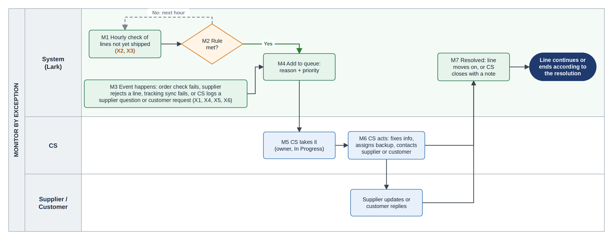
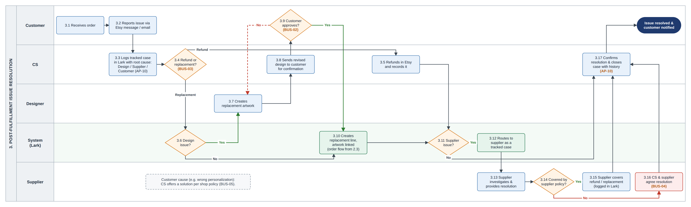
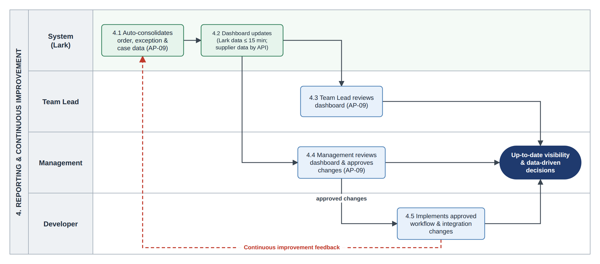
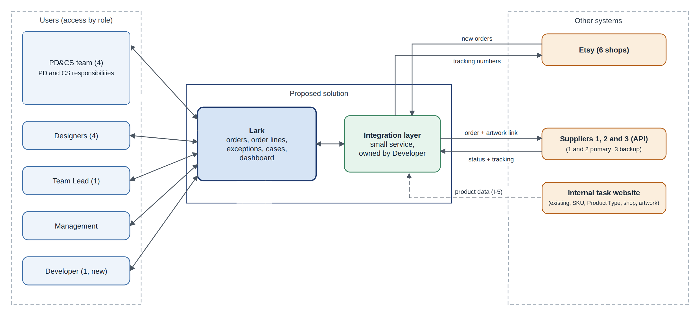
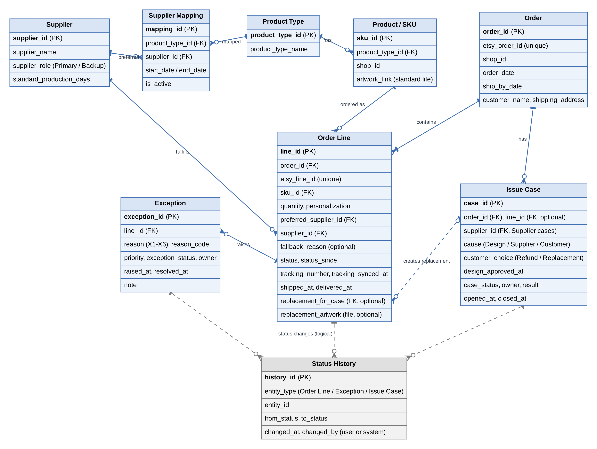
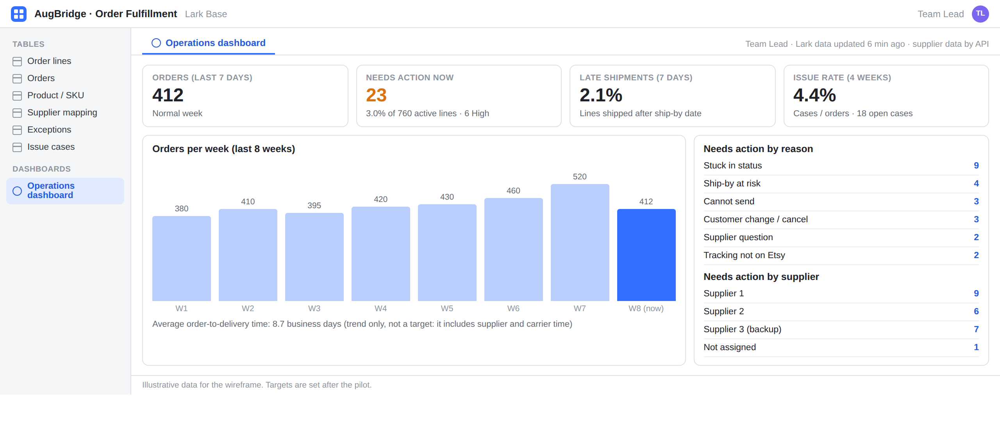

# Functional Requirements Document (FRD)

*AugBridge Commerce - Solution Design and System Requirements*

[← BRD](02-brd.md) · [README](../README.md) · [User Stories →](04-user-stories.md)

---

## 1. Solution Overview

The solution uses Lark as the shared operational workspace for order fulfillment. Orders are received from Etsy automatically. For each order line, the system uses the SKU to identify the Product Type, assigns the preferred supplier, validates the line, and sends it to the supplier through an API. The system receives supplier status and tracking updates. The selected tracking number is then synced to Etsy according to the tracking rule. If the preferred supplier cannot fulfill an order line, CS can assign Supplier 3 as the backup supplier for that line only. CS works from one exception queue that shows order lines requiring action.

## 2. Solution Evaluation and Selection

### 2.1 Options and Scores

Criteria come from the business requirements and constraints in the BRD.

*Weights: High = 3, Medium = 2, Low = 1. Ratings: Strong = 3, Adequate = 2, Weak = 1.*

| Criterion (weight) | A. Lark | B. Airtable + Slack + Zapier | C. Notion + Slack + Make | D. Custom web app | E. Better spreadsheets |
|---|---|---|---|---|---|
| **C-1** Linked tables for orders, mapping, cases (3) | Strong | Strong | Adequate | Strong | Weak |
| **C-2** Automation with rules (3) | Strong | Strong | Adequate | Strong | Weak |
| **C-3** API / webhook support (3) | Adequate | Strong | Adequate | Strong | Weak |
| **C-4** Built-in dashboard (2) | Strong | Adequate | Weak | Strong | Weak |
| **C-5** Chat and task assignment (2) | Strong | Adequate | Adequate | Weak | Weak |
| **C-6** Cost for ~10 users (2) | Strong | Weak | Adequate | Weak | Strong |
| **C-7** One Developer can maintain it (2) | Strong | Adequate | Adequate | Weak | Strong |
| **C-8** Easy for non-technical staff (1) | Adequate | Adequate | Strong | Weak | Strong |
| **Weighted total (max 54)** | **50** | **43** | **35** | **40** | **28** |

C-1 to C-5 come from the business requirements: C-1 from BR-01, BR-02 and BR-07; C-2 from BR-03 and BR-04; C-3 from BR-03 and BR-05; C-4 from BR-06; and C-5 from BR-04 and the existing chat-based process in AP-03. C-6 and C-7 come from the cost constraint and the one-Developer setup. C-8 reflects the needs of the mainly non-technical users. All options except Better Spreadsheets require a small integration layer to connect Etsy and the suppliers. This does not change the ranking.

### 2.2 Decision

Lark is the proposed solution because it has the highest score under the stated criteria and constraints. It scores 50 out of 54, compared with 43 for the Airtable-based option. The main reason is fit with the process problem. Operational information is currently spread across multiple tools (AP-03, AP-10), so using several separate tools could create the same problem. Lark provides one shared workspace for orders, supplier mapping, exceptions, issue cases, and reporting. It also fits the expected cost for about 10 users and the planned one-Developer setup. Lark is proposed only for the order fulfillment workflow. The internal task platform remains unchanged.

**Key trade-offs**

| Trade-off accepted | How It Is Handled |
|---|---|
| API support is Adequate, not Strong. | Use a small integration layer and failure alerts. Lines that fail to send or update remain visible in the exception queue (X2). |
| One platform creates a single dependency. | The current manual process remains available as a fallback if the pilot is stopped. |
| Lark plan limits may affect data volume. | Check limits before the pilot for about 21,000 orders/year at the planning baseline (400 × 52), plus peak-season volume. Archive closed orders regularly. |
| Customer personal data is stored in a vendor platform. | Check data location and retention with the vendor before go-live. |

**Why other options were not selected**

| Option | Why It Was Not Selected |
|---|---|
| Airtable or Notion stack (B, C) | Multiple tools would spread information across separate systems again (AP-03). Airtable is weaker on cost for about 10 users, while Notion is weaker on linked data and dashboards. |
| Custom web app (D) | Provides full control, but one Developer would need to build and maintain the whole system. |
| Seasonal staff instead of a system | Adds manual capacity during peak season but does not provide a shared order view or exception queue. Seasonal staff may still be used alongside the solution. |
| Automatic supplier re-routing | Requires supplier stock or capacity data, which is not currently available. CS therefore assigns Supplier 3 to a single order line when needed. |

## 3. To-Be Roles and Access

### 3.1 To-Be Roles

| Role | People | Main work |
|---|---|---|
| **PD&CS team** | 4 | Product Development (PD) work: Product research, product development, and listing, maintain Product Types, supplier mapping, supplier setup data, and standard production days. Customer Support (CS) work: manage customer messages, exception queue, supplier follow-up, and issue cases. |
| **Designers** | 4 | Create artwork and replacement artwork for design issue cases. |
| **Team Lead** | 1 | Oversee daily operations, set priorities, and review the dashboard. |
| **Developer (new)** | 1 | Maintain Lark, integrations, and workflows; implement approved changes. |
| **Total** | **10** | 9 existing people + 1 new Developer |

Product research and listing stay in the existing process and are out of scope. PD and CS are responsibilities within the PD&CS team, not separate job titles.

### 3.2 RACI (To-Be)

*R = does the work, A = accountable, C = consulted, I = informed.*

| Activity | PD | CS | Designer | Supplier | Team Lead | Mgmt | Dev |
|---|---|---|---|---|---|---|---|
| Maintain Product Types and Product Type-to-supplier mapping | R/A | I |  |  | I |  | C |
| Assign Supplier 3 to a line when the preferred supplier cannot fulfill it | I | R/A |  | I |  |  |  |
| Work the exception queue |  | R/A |  | C | I |  |  |
| Handle customer change or cancel requests |  | R/A |  | C |  |  |  |
| Handle a design issue case |  | A | R |  | I |  |  |
| Handle a supplier issue case | I | A |  | R | I |  |  |
| Review the dashboard |  |  |  |  | R | A |  |
| Maintain integrations and workflows (technical upkeep) |  |  |  |  | I | I | R/A |
| Approve workflow or integration changes |  |  |  |  | C | R/A |  |
| Implement approved workflow or integration changes |  |  |  |  |  | A | R |

### 3.3 Access By Role

CS can assign the backup supplier to a single line (X1) but cannot change the mapping.

| Role | Order / order line | Product Type, SKU, supplier and mapping data | Exception | Issue case | Dashboard |
|---|---|---|---|---|---|
| **CS** | View / Edit | View | View / Edit | View / Edit | View |
| **PD (mapping owner)** | View | Edit | View | View | View |
| **Designer** | View assigned design-case lines | – | – | View / Edit assigned design cases | – |
| **Team Lead** | View | View | View | View | View |
| **Management** | – | – | – | – | View |
| **Developer** | Admin | Admin (setup/support) | Admin | Admin | Admin |

## 4. To-Be Process

Green boxes are done by the system. Product research, Product/Design Tasks and listing stay on the existing internal task website and are not shown. Lark is introduced only for the order fulfillment workflow.

### 4.1 Order Management and Fulfillment

*Figure 1. To-Be Order Management and Fulfillment Process Diagram*

- Orders are received in Lark automatically from Etsy (2.2). Each order line is processed separately. The system uses the SKU to find the Product Type and active preferred supplier (2.3), then validates the line (2.5).

- If validation fails, the line is placed in X1 (2.7) and is checked again after the issue is fixed. A valid line is sent to the preferred supplier through the API (2.8a). If the supplier cannot fulfill the line, X1 is raised (2.8b) and CS can assign Supplier 3 as the backup for that line only.

- Supplier status and tracking are returned to Lark (2.10). The first tracking number received for an Etsy order is synced to Etsy according to BUS-07 (2.11).

### 4.2 Monitor By Exception

*Figure 2. Monitor By Exception Process Diagram*

All in-scope order exceptions go to one queue owned by CS. X2 and X3 are raised by the hourly check, while X1, X4, X5 and X6 are event-based. Detailed exception rules are defined in §5.

### 4.3 Post-Fulfillment Issue Resolution

*Figure 3. To-Be Post-Fulfillment Issue Resolution Process Diagram*

- Every customer issue is logged as an issue case with a cause: Design, Supplier or Customer (3.3).

- The customer chooses between a refund and a replacement (3.4). A replacement is created as a new order line linked to the issue case (3.10) and follows the normal fulfillment flow.

- For Design issues, the Designer provides replacement artwork (3.7), and customer approval is required if the design changes (3.8–3.9). Supplier issues are handled with the supplier under its policy, while customer-caused issues follow the shop policy.

### 4.4 Reporting and Continuous Improvement

*Figure 4. To-Be Reporting And Continuous Improvement Process Diagram*

The system updates operational data and dashboard figures, so no manual weekly report is needed. The Team Lead reviews the dashboard, Management approves required workflow or integration changes, and the Developer implements the approved changes (4.1–4.5).

## 5. Exception Handling

All in-scope order exceptions are managed in one queue owned by CS. The system raises exceptions based on order status, expected time, ship-by date, or events such as validation failure, supplier notification, customer requests, or tracking sync failure.

X2 and X3 are raised by an hourly check. X1, X4, X5 and X6 are event-based. CS takes the exception, works on it, and closes it when the resolution condition is met.

Post-fulfillment customer issues are handled separately as issue cases (§4.3).

### 5.1 Order Line Statuses

| Status | Meaning | Set by | Expected time in this status |
|---|---|---|---|
| **New** | Order line received from Etsy | System | Up to 15 minutes |
| **Ready to send** | Order line has passed validation and has a preferred supplier assigned. | System | Moves automatically through the API. X2 is raised if it stays here beyond the agreed threshold. |
| **Sent to supplier** | Order line has been sent to the supplier through the API. | System | 1 business day for supplier confirmation *(assumed; confirm in pilot)* |
| **In production** | Supplier has confirmed the order. | Supplier API | Supplier’s standard production days |
| **Shipped** | Supplier has shipped the order and provided a tracking number. | Supplier API | Carrier time is out of scope. |
| **Delivered** | Order has been delivered, if the supplier provides this status. | Supplier API | \- |
| **Canceled** | Order line is canceled before production starts. | CS | \- |

Each supplier may use different status names. These are mapped to the standard statuses during supplier setup. Standard production days are stored for each supplier and updated by PD when needed, including for peak season. The time limits above are system settings and will be confirmed in the pilot.

### 5.2 Exception reasons

| ID | Reason | Trigger | Raised when | CS action | Resolved when |
|---|---|---|---|---|---|
| **X1** | Cannot send | Event | Validation fails; no active supplier mapping; or supplier rejects the line because it cannot fulfill it. | Fix the issue. If the supplier cannot fulfill the line, assign Supplier 3 to that line only and record the fallback reason. | The blocking issue is fixed and the line is ready to be sent again. |
| **X2** | Stuck in status | Hourly check | An order line stays in a status longer than its expected time and no open exception covers the same issue. | For Ready to send, check the API error with the Developer. For Sent to supplier/In production, check supplier status or contact the supplier. If the ship-by date will be missed, inform the customer. | The line moves to the next status. |
| **X3** | Ship-by date at risk | Hourly check | The line is not shipped, has no open exception covering the same issue, and either the expected ship date is after the Etsy ship-by date or the ship-by date is 1 business day away or less. | Check with the supplier and contact the customer when needed. | Line is shipped |
| **X4** | Supplier notification | Event | A supplier sends a notification about an order line that requires CS action. | Review the notification, take the required action, and record the response or result. | CS records the resolution note. |
| **X5** | Customer change or cancel | Event | CS receives a customer change or cancellation request through Etsy, email, or an Etsy cancellation. | Before production, ask the supplier to make the change or cancel the line. After production starts, follow BUS-01 and inform the customer. | Supplier confirms the change/cancellation, or CS records the response when the request cannot be accepted. |
| **X6** | Tracking not on Etsy | Event | The tracking number selected for Etsy cannot be synced to Etsy. | Add the tracking number to Etsy manually and confirm it is shown on the order. | CS confirms the tracking number is on Etsy. |

### 5.3 Rules

- **Priority**: High when an order line is not shipped and its ship-by date has passed or is 1 business day away or less. Otherwise, the priority is Normal. The hourly check updates the priority as the ship-by date gets closer.

- **Expected ship date**: The date the line was sent to the supplier plus the supplier's standard production days. X3 uses this date to identify lines that may miss the Etsy ship-by date. Lines that have not yet been sent are monitored by X2.

- **Exception status**: Open → In Progress → Resolved. A new exception has no owner. When a CS user takes it, the exception becomes In Progress and that user becomes the owner.

- **Escalation**: If a High-priority exception remains Open without an owner for more than 2 working hours, the hourly check notifies the Team Lead. This 2-hour threshold is assumed and will be confirmed in the pilot.

- **Closing**: X1, X2 and X3 close automatically when their resolution condition is met. X4, X5 and X6 are closed by CS based on their specific resolution rules.

- **Exception triggers**: X2 and X3 are time-based and checked every hour for lines that are not yet shipped. Canceled lines are excluded. X1, X4, X5 and X6 are event-based.

- **No duplicates**: The hourly check does not create another X2 or X3 when an open exception already covers the same unresolved issue. Instead, the existing exception is kept and its priority is updated when needed. A different event can still create another exception on the same line.

- **Mapping changes**: A supplier mapping change applies only to lines assigned after the mapping becomes effective. A line that is already Ready to send keeps its existing supplier.

- **Backup supplier**: When a supplier cannot fulfill a line, X1 is raised. CS can assign Supplier 3 to that line only and record the fallback reason. The preferred supplier and Product Type mapping do not change. Supplier 3 is used only before the line enters In production. There is no automatic re-routing.

- **API outage**: If a supplier API is temporarily unavailable, the failed send is logged and the affected line remains visible in Lark. The current manual supplier process may be used as a contingency if needed. This is not part of the normal flow.

- **Tracking to Etsy**: The first tracking number received for an Etsy order is synced to Etsy. Later tracking numbers remain on their respective lines in Lark. X6 is raised only when the selected tracking number fails to sync.

- **Carrier delays**: Carrier delays after shipping are out of scope for the exception queue. Customer-reported lost or late parcels are handled as issue cases under the supplier process.

- **Pilot measure**: The pilot measures open exceptions per day and the percentage of late lines flagged early. These measures show whether the rules help identify problems earlier; they do not reduce supplier or carrier processing time.

## 6. Integration Overview

*Figure 5. System Context*

The integration layer is a small service maintained by the Developer. It transfers data between Etsy, Lark, and supplier APIs, prevents duplicate orders, and logs integration failures. All three suppliers are connected through API.

Figure 5 shows the system context. Suppliers remain external systems and do not use Lark.

| ID | Flow | Trigger | What happens | If it fails |
|---|---|---|---|---|
| **I-1** | Etsy → Lark: New orders | Etsy webhook or periodic order check if webhook is unavailable | Creates the Etsy order and one order line per item. Etsy Order ID is used as the unique key, so the same order is not created twice. | Alert the Developer. A daily order-count check per shop identifies missing orders. |
| **I-2** | Lark → Supplier: Orders | Order line becomes Ready to send | Sends order details, personalization text, artwork link, and shipping address to the assigned supplier through API. The supplier returns accepted or rejected because it cannot fulfill the line. | Failed send is logged and the line stays Ready to send until X2. Supplier rejection raises X1 immediately. |
| **I-3** | Supplier → Lark: Status & Tracking | Supplier API update | Updates the order line with status, tracking number, and relevant dates. | The line stays in its current status and may raise X2 if the expected time is exceeded. |
| **I-4** | Lark → Etsy: Tracking | An order line receives the first tracking number for its Etsy order | Sends the selected tracking number to the matching Etsy order according to BUS-07. | X6 is raised on the line and CS adds the tracking number to Etsy manually. |
| **I-5** | Internal Task Platform → Lark: Product Data | Sync or regular import; method confirmed in R0 | Provides Lark with the SKU, Product Type, Etsy shop, and standard artwork link needed for fulfillment. Lark does not modify the tasks. | If the SKU is missing in Lark, the order line gets X1 (INVALID_SKU) and is checked again after the product data is available. |

### 6.1 Key field mapping (Etsy order → Lark)

| Etsy order data | Lark field | Note |
|---|---|---|
| Order ID | Order.etsy_order_id | Unique key used to prevent duplicate orders. |
| Ship-by date | Order.ship_by_date | Used to calculate exception priority and identify lines at risk. |
| Buyer name and shipping address | Order.customer_name, Order.shipping_address | Used for fulfillment and support; sent to the supplier. |
| Item ID | Order Line.etsy_line_id | Identifies the Etsy order line. |
| SKU | Order Line.sku_id | Used to find the Product Type, standard artwork, and preferred supplier. |
| Personalization text | Order Line.personalization | Customer-provided order data sent to the supplier. |
| Standard artwork link | Product/SKU.artwork_link | Product data from the Product/Design Task; sent to the supplier. |
| Product Type | Product/SKU.product_type_id | Product data from the Product/Design Task; used for supplier mapping. |
| Replacement artwork | Order Line.replacement_artwork | Added by the Designer for a replacement line after approval; sent to the supplier. |

## 7. Data Model

*Figure 6. Logical Data Model*

- Figure 6 shows the logical data model. It defines the main data used by the order fulfillment process; it is not a physical database design.

- Order represents the Etsy transaction and stores the Etsy Order ID. Order Line is the fulfillment unit for each item. Each line has its own SKU, Product Type, supplier, status, tracking, and exceptions. One order can contain lines handled by different suppliers, and CS can find all lines using the Etsy Order ID.

- Product/SKU is the product data needed by the fulfillment flow from the internal task platform: SKU, Product Type, Etsy shop, and standard artwork link. Product/Design Tasks, Etsy listings, and artwork management are not modeled because they are out of scope.

- Supplier Mapping stores the preferred supplier for each Product Type. It keeps mapping history with start and end dates and allows only one active preferred supplier at a time. Only primary suppliers can be used in the mapping.

- Order Line stores both the preferred supplier from the mapping and the supplier that actually fulfills the line. Normally they are the same; when CS uses Supplier 3 as fallback, the actual supplier changes to Supplier 3 and the fallback reason is recorded.

- Exception stores exception history for order lines, including the reason, priority, status, owner, and timestamps.

- Status History records status changes for order lines, exceptions, and issue cases, including when and by whom the change was made. This supports operational tracking and KPI measurement.

- Issue Case stores the issue cause, customer choice, owner, supplier where applicable, and result. A replacement is created as a new Order Line linked to the Issue Case. For design cases, the Designer attaches the approved replacement artwork to the replacement line.

- Dashboard figures are calculated from the underlying data and are not stored separately.

## 8. Functional Requirements

| ID | Functional Requirement | BR | Priority |
|---|---|---|---|
| **FR-01** | The order line view shall show order details, SKU, Product Type, supplier, current status, tracking number, and open exceptions in one view. CS can search by Etsy Order ID to see all lines in the order. | BR-01 | Must |
| **FR-02** | The system shall control access by role according to the access table in §3.3. Only PD can update the Product Type-to-supplier mapping. | BR-01 | Must |
| **FR-03** | The system shall maintain a Product Type-to-preferred-supplier mapping with start and end dates, with no more than one active preferred supplier per Product Type. Only primary suppliers (1 and 2) can be selected as preferred suppliers. A mapping change does not reassign a line that is already Ready to send or later. | BR-02 | Must |
| **FR-04** | The system shall identify the preferred supplier for each order line using SKU → Product Type → active supplier mapping. Lines for different suppliers are sent separately. If no active mapping exists, the line gets X1 (NO_ACTIVE_SUPPLIER_MAPPING) and PD is notified. If the preferred supplier cannot fulfill the line, CS can assign Supplier 3 to that line only and record the fallback reason. | BR-02 | Must |
| **FR-05** | The system shall create each new Etsy order in Lark with one order line per item within 15 minutes of the order event. The same Etsy order shall not be created twice. A daily count check shall compare Etsy and Lark orders by shop and alert the Developer if the counts differ. | BR-03 | Must |
| **FR-06** | The system shall validate each new order line before sending it to the supplier. Required data includes a complete shipping address, a valid SKU, quantity of at least 1, and applicable artwork. A failed check raises X1 and the line is not sent. | BR-03 | Must |
| **FR-07** | The system shall send each Ready to send order line to its assigned supplier through the API, including order details, personalization when present, the applicable artwork link, and shipping address. The supplier response is recorded. An accepted line becomes Sent to supplier; a rejection because the supplier cannot fulfill the line raises X1. A failed API send is logged and the line remains Ready to send. | BR-03 | Must |
| **FR-08** | CS shall be able to log a supplier notification on an order line as X4. The exception can be closed only after CS records the action or response. | BR-03 | Should |
| **FR-09** | The system shall update order-line status, tracking number, and relevant dates from the supplier API for all three suppliers. Failed updates are logged and shown, and the affected line is not changed by the failed update. | BR-04 | Must |
| **FR-10** | The system shall raise exceptions X1–X6 according to the triggers and rules in §5. X2 and X3 are checked hourly; the other exceptions are event-based. The system shall not create duplicate X2 or X3 exceptions for an unresolved issue already covered by an open exception. | BR-04 | Must |
| **FR-11** | The exception queue shall show Open and In Progress exceptions, with High priority first and then the earliest ship-by date. When CS takes an exception, it becomes In Progress and that CS user becomes the owner. Exceptions close and escalate according to §5.3. | BR-04 | Must |
| **FR-12** | CS shall be able to log a customer change or cancel request as X5. Before production starts, CS can request the change or cancellation through the supplier's supported process. After production starts, the system blocks changes and cancellation and CS informs the customer according to BUS-01. | BR-04 | Should |
| **FR-13** | The system shall sync the first tracking number received for an Etsy order to that order and keep later tracking numbers on their respective lines in Lark. If the selected tracking number cannot be synced, X6 is raised and CS can add it to Etsy manually. | BR-05 | Must |
| **FR-14** | The dashboard shall show orders from the last 7 days, open exceptions by reason and supplier, late shipment rate, issue rate from R4, and average order-to-delivery time as a trend. Lark-based figures are no more than 15 minutes old, while supplier figures reflect the latest update received. The dashboard is available to the Team Lead and Management. | BR-06 | Should |
| **FR-15** | CS shall be able to create an issue case linked to an order and, where known, an order line. The case shall record the cause as Design, Supplier, or Customer, as well as the owner and result. Design cases are assigned to a Designer; supplier cases are linked to the relevant supplier. | BR-07 | Should |
| **FR-16** | CS shall record the customer's choice of refund or replacement. For a replacement, the system shall create a new order line linked to the issue case. The replacement line follows the normal fulfillment flow. For a Design case, the Designer attaches the approved replacement artwork before the line can be sent. If the design changes, customer approval must be recorded first. | BR-07 | Should |

## 9. Non-Functional Requirements

| ID | Area | Requirement |
|---|---|---|
| **NFR-01** | Performance | New Etsy orders should appear in Lark within 15 minutes. Dashboard figures from Lark data should be no more than 15 minutes old, supplier data should reflect the latest update received, and the X2/X3 exception check should run every hour. These are assumed values and will be confirmed in the pilot. |
| **NFR-02** | Failure handling | Every failed API call or data sync shall be logged and shown to the Developer or CS. |
| **NFR-03** | History | Status changes for order lines, exceptions, and issue cases shall record the time and the user or system that made the change. |
| **NFR-04** | Personal data | Store only customer data needed for fulfillment and support. Closed orders shall be archived or anonymized according to the agreed policy. The vendor's data location shall be checked before go-live. |
| **NFR-05** | Data volume | The solution should support about 21,000 orders per year at the planning baseline (400 × 52), plus peak-season volume and additional order lines. Closed records should be archived as needed to stay within platform limits. Exact limits will be confirmed before the pilot. |

## 10. Wireframes

Illustrative data only. These wireframes show how the requirements may be presented in Lark; they are not the final Lark configuration.

### 10.1 Needs Action And Order Search - FR-01, FR-10, FR-11

*Figure 7. Lark Base Order Line Views: Exception Handling and Order Search.*

Figure 7 shows the order-line views for exception handling and order search. The views allow CS to see open exceptions, prioritize work, and search all order lines by Etsy Order ID.

### 10.2 Operations Dashboard - FR-14

*Figure 8. Operations Dashboard.*

Figure 8 shows the operations dashboard for the Team Lead and Management. It provides operational visibility through order volume, open exceptions, late shipments, issue rate, and order-to-delivery time trends.

## 11. Release Plan

The release sequence is based on dependencies rather than fixed dates. The release for each requirement is shown in the [RTM](06-rtm.md).

| Release | What it delivers | Exit condition |
|---|---|---|
| **R0 Discovery and baseline** | Confirm Etsy API access and limits; supplier API connectivity and capabilities; required supplier identifiers; Product Type list and mapping; fallback rules; required order fields; supplier update/cancel process; product data handoff from the task platform; and Lark plan limits. Measure the R0 baseline for manual order-handling time, tracking delay, and late shipments. | Required integrations, Product Types, mapping, and fallback rules are confirmed; baseline metrics are measured. Management decides to continue, adjust scope, or stop. |
| **R1 Core order fulfillment** | Set up Lark and roles. Build and test the core flow: Etsy order → SKU → Product Type → preferred supplier → validation → supplier API → status/tracking → Etsy tracking. Implement the core exception flow X1, X2, X3, and X6, including Supplier 3 fallback. | All applicable P1 tests pass; role access is confirmed; the Developer confirms the hourly exception check is running as expected. |
| **R2 Pilot and measure** | Run the R1 core flow on live orders within a limited scope. Suppliers 1 and 2 remain primary; Supplier 3 is the backup. Customer change/cancel requests continue to use the current process until X5 is released in R3. | R2 measures are compared with the R0 baseline and planning benchmark. Management decides to continue, adjust, or stop. |
| **R3 Queue additions and dashboard** | Add supplier notifications (X4), customer change/cancel requests (X5), and the operational dashboard. Add the remaining shops. | All applicable P1 tests pass; reporting effort is re-measured. |
| **R4 Issue cases** | Add issue cases, refunds, replacements, and replacement artwork. Move open cases into Lark and add issue rate to the dashboard. | All applicable P1 tests pass. |
| **R5 Peak season review** | Run through one full peak season and measure open exceptions, queue backlog, manual order-handling time, fallback lines, tracking delay, and late shipments. | Results are compared with the baseline. Management decides whether the current rules and supplier setup should remain or change. KPI targets are then set. |

### 11.1 Pilot

The R2 pilot runs the core R1 flow on live orders within a limited scope and compares the results with the R0 baseline. The pilot uses normal weeks only and runs long enough to complete the 2-week time sample.

| Item | Definition |
|---|---|
| Scope | Core order fulfillment flow from R1: normal API fulfillment with Suppliers 1 and 2, Supplier 3 fallback, core exceptions X1, X2, X3 and X6, tracking rule, and orders with lines handled by different suppliers. |
| Shops | 1 or 2 of the 6 shops, selected at the R0 gate. Other shops remain on the current process until R3. |
| Suppliers | Suppliers 1 and 2 are primary; Supplier 3 is the backup. Supplier 3 fallback is tested at least once. |
| Duration | Normal weeks only; long enough to complete the 2-week time sample. |
| Baseline | R0 measures manual order-handling time per order, tracking delay, and late shipments. |
| Success measures | Manual time per order (R0 vs R2 and against the planning benchmark), tracking delay, needs-action lines per day, late lines flagged early, and fallback lines per week. No targets are set before the pilot. |
| Entry criteria | R0 gate decision is “continue”; mapping is checked; Etsy and supplier APIs are confirmed; all applicable P1 tests for R1 pass; pilot-shop open orders are loaded into Lark and record counts match the current tools. |
| Exit criteria | R2 measures are completed and compared with the R0 baseline. Management reviews the results and decides to continue, adjust, or stop. |
| Stop or roll back | The current manual process remains available for the pilot shops. If the pilot stops, those shops return to the current process; other shops are not affected. |
| Change or cancel requests | Not included in the pilot. X5 is released in R3; until then, customer requests follow the current process. |

---

[← BRD](02-brd.md) · [README](../README.md) · [User Stories →](04-user-stories.md)
